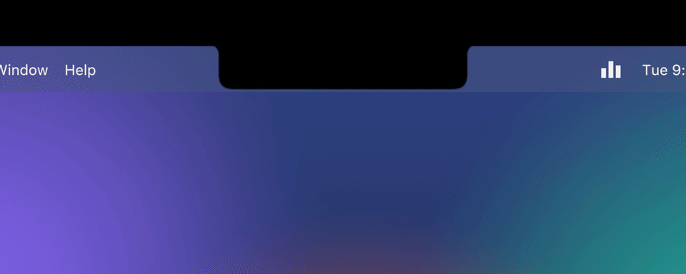
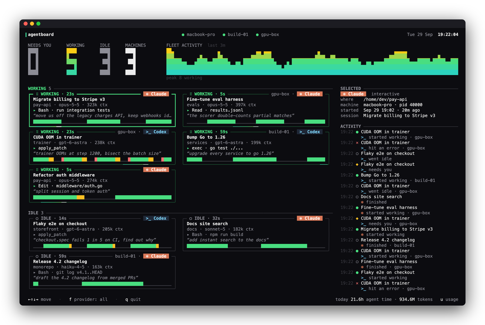
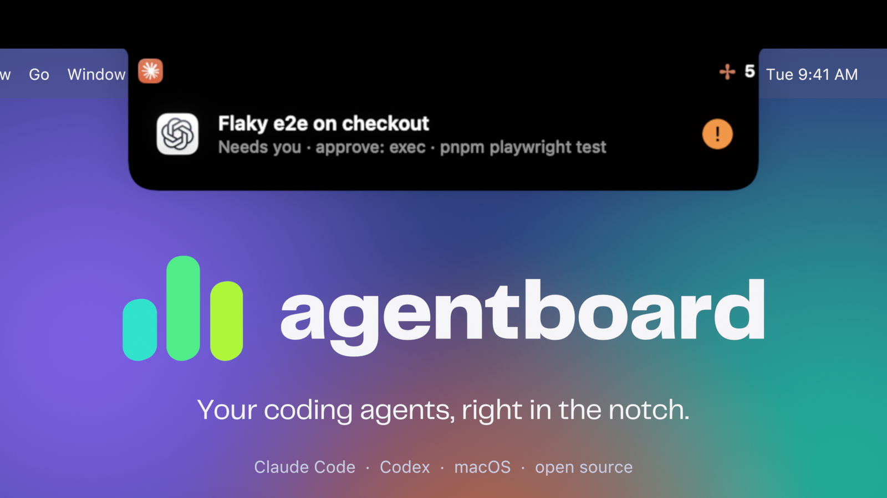
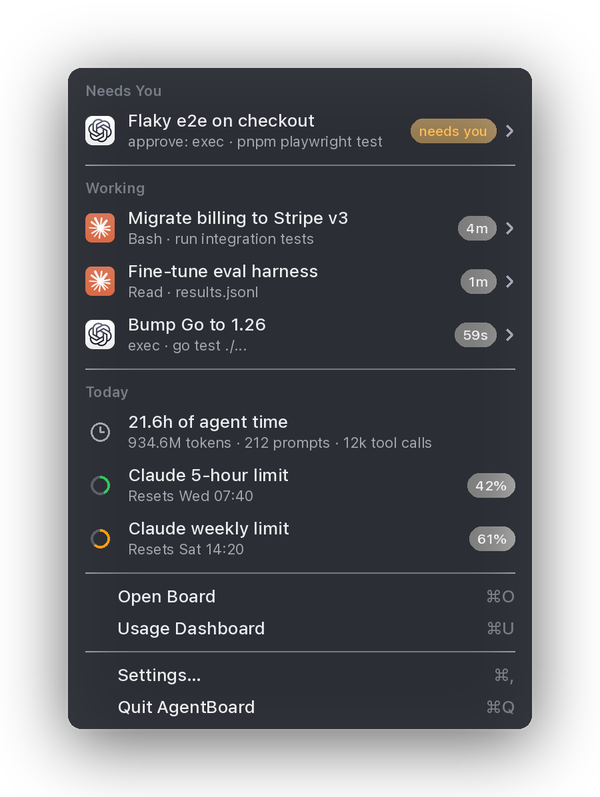
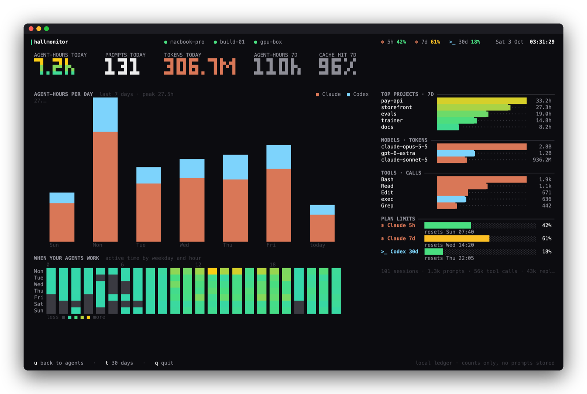

<div align="center">

# agentboard

**A live board for your coding agents.**
Claude Code and Codex, on this machine and your servers, in your terminal, menu bar and notch.



[▶ Launch film](https://github.com/hiteshbandhu/agentboard/releases/download/v0.1.1/agentboard-launch.mp4) · [Install](#install) · [The board](#the-board) · [Notch & menu bar](#notch--menu-bar) · [Usage & limits](#usage--limits) · [Other machines](#other-machines) · [Privacy](#privacy)

</div>

---

You start an agent, switch to something else, and ten minutes later wonder: is it done? Is it stuck waiting for approval? Which of the five terminals was it in? agentboard answers that at a glance:

- **Who's working, who's idle, who needs you**: every Claude Code and Codex session, live.
- **What each one is doing**: current tool, last prompt, model, context size.
- **Across machines**: your laptop, dev box and GPU server on one board, over plain SSH.
- **How much you use them**: agent-hours, tokens, cache hits, plan limits.

It only reads. It never sends prompts, approves anything, or talks to your agents.

## Install

```bash
brew install hiteshbandhu/tap/agentboard             # the board (macOS, Linux)
brew install --cask hiteshbandhu/tap/agentboard-app  # menu bar + notch app (macOS 14+)
```

Or download a binary from [Releases](https://github.com/hiteshbandhu/agentboard/releases), or build from source with Go 1.26+:

```bash
go install github.com/hiteshbandhu/agentboard/cmd/agentboard@latest
```

Then:

```bash
agentboard          # the board
agentboard --demo   # a demo fleet, to see it before your agents are running
```

## The board



Cards are grouped into **Needs you → Working → Idle**. Working cards spin; cards that need you pulse amber and say why (a permission prompt, a question, an error). Each card shows the project, model, context size, current tool, last prompt and a timeline of recent activity, and the waveform up top is your whole fleet over the last few minutes.

| Key | |
|---|---|
| ← ↑ ↓ → | move between cards |
| `f` | filter: all / Claude / Codex |
| `s` | show sessions idle for over a day |
| `u` | usage & limits |
| `q` | quit |

Put it on a second display and leave it there.

## Notch & menu bar



On a MacBook, agentboard lives around the notch: small ears show who's working, it drops open when an agent needs you or finishes a long task, and hovering the notch lists everything in flight. It never takes clicks.



The menu bar item is a regular macOS menu: agents with their project and status, today's usage, plan limits, and shortcuts to open the board. You also get a notification when an agent needs you.

Settings let you turn the notch, notifications, the agent count and plan usage in the menu bar on or off, and launch at login.

The app never asks for access to your folders: project icons are only looked up inside project folders, and never in Desktop, Documents, Downloads or Library.

<br clear="right">

## Usage & limits



Press `u` on the board, or run `agentboard usage`. agentboard keeps a small local ledger of how you use agents, built from the logs Claude Code and Codex already write: agent-hours per day, when in the week you work, top projects, models and tools, and cache hit rate. It keeps only counts; no prompt text is stored.

**Plan limits** show in the board's top bar and in the menu:

- **Codex**: read automatically from Codex's own logs.
- **Claude Code**: Claude Code shares your 5-hour and weekly limits only with its status line, so point the status line at agentboard once:

  ```bash
  agentboard statusline --install
  ```

  It backs up `~/.claude/settings.json`, and keeps your existing status line if you have one. Limits refresh every time Claude Code replies in a terminal session and show up on the board within a few seconds. Sessions run from the Claude desktop app don't have a status line, so they don't refresh it; a reading older than 15 minutes is shown with a `~` (`~71%`) so you know it's not live.

## Other machines

agentboard watches remote hosts over SSH, with no daemon or open port. Install agentboard on the server, then:

```bash
agentboard --host dev@gpu-box --host build-01
```

Or list hosts, one per line, in `~/.config/agentboard/hosts`. Each host keeps one SSH connection streaming `agentboard --stream`, reconnects on its own, and shows up as a chip in the top bar (green when live, red with the error when it isn't). Key-based SSH login is required; if `agentboard` isn't on the remote's PATH, pass `--remote-cmd /path/to/agentboard`.

## How status works

| | Source | States |
|---|---|---|
| Claude Code | `claude agents --json`, `~/.claude/sessions/*.json`, the session transcript | working, needs you (with the reason), idle, blocked |
| Codex | live `codex` processes and their session logs; the Codex app-server when it's running | working, needs you, idle, error |

Sessions idle or blocked for more than a day are tucked away (`s` shows them).

## Terminals and logos

Provider logos are drawn as real images in terminals that speak the kitty graphics protocol (Ghostty, cmux, kitty, WezTerm), and as colored ✻ Claude / >_ Codex marks elsewhere. `--images off` turns them off. Logos come from the Claude and ChatGPT apps if they're installed; otherwise Claude's mark is fetched once from Simple Icons and cached (`--no-fetch` to never touch the network).

## Privacy

- Local and read-only. No telemetry, no accounts.
- Reads session metadata and transcript tails on your machine; never your auth files or tokens.
- The usage ledger (`~/.local/share/agentboard/usage/`) stores counts only.
- Remote hosts use your own SSH, and send the same metadata back.

## Reference

```text
agentboard [flags]
  --demo                 synthetic fleet
  --host user@host       also watch a machine over SSH (repeatable)
  --view agents|usage    screen to open on
  --provider claude,codex
  --cwd ~/code/project   only sessions under a directory
  --once | --json        print once and exit
  --images auto|kitty|blocks|off
agentboard usage [--days 7|30] [--json]
agentboard statusline [--install] [--then '<your status line>']
```

## Building

```bash
go build ./cmd/agentboard     # the CLI
macos/build.sh --install      # the menu bar app (needs the Xcode command line tools)
scripts/release.sh 0.1.0      # release artifacts
```

`launch/` has the scripts that make the launch film: an original beat synthesized in Python and procedural motion design in Blender.

## License

MIT
